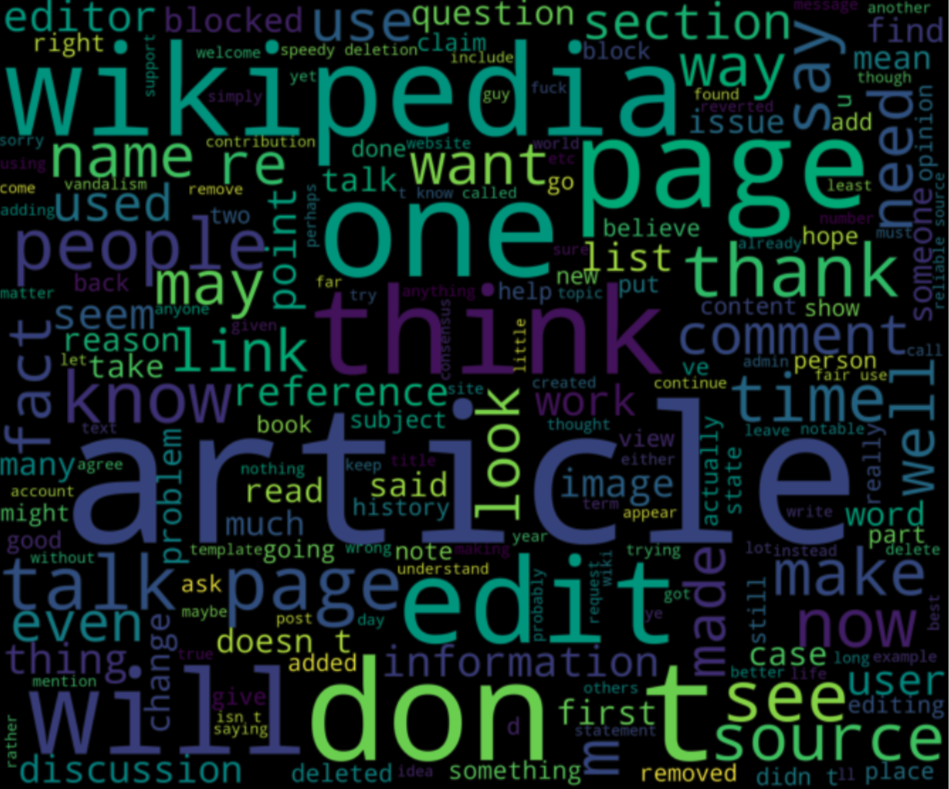
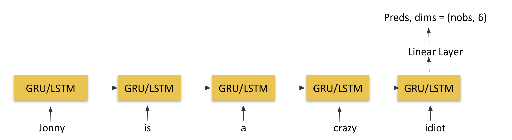

# Toxic-comment-classification

## Motivation: 
Toxic comments on a platform can be defined as user comments that are rude, disrespectful or something that disengages other users from using the platform. Toxic, abusive and  online harassment is an issue that plagues online platforms and results in users to stop using the platform leading to business loss and drop in daily active users. 
Platforms thus needs to identify such user comments and take action on time to avoid negative fallout and user churn from the platform.
## Challenge:
To build a multi-class NLP classifier which identifies different types of toxic comments such as threats, obscenity, insults, identity-based hate etc since some platforms are fine with certain types of profanity but not other type of toxic content/comment. 
## Data: 
https://www.kaggle.com/competitions/jigsaw-toxic-comment-classification-challenge/data

 
Wikipedia comments which have been labeled by human raters for toxic behavior into Toxic, severe_toxic, obscene, threat, Insult, identity_hate. 

## Model:
We used different sequential models to tackle this problem. We started with a basic Vanilla RNN network with a linear layer to get the prediction. We picked gensim pretrained embeddings. Later we also tried LSTM and GRU modules. 
The basic architecture with GRU/LSTM units is:

 

## References: 
Jigsaw
Conversation AI

